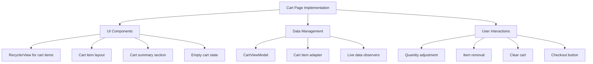

# Cart Implementation Plan

## Overview
This document outlines the implementation plan for the shopping cart functionality in our Android e-commerce application.

## Architecture Components

## 1. UI Components

### Cart Item Layout (item_cart.xml)
- Product image
- Product name
- Price per item
- Quantity controls (decrease, current quantity, increase)
- Subtotal
- Remove item button

### Main Cart Layout (fragment_cart.xml)
- RecyclerView for cart items
- Cart summary section showing:
  - Total items
  - Subtotal
  - Any applicable taxes/fees
  - Final total
- Checkout button
- Empty state view when cart is empty

## 2. Data Management

### CartViewModel
- LiveData for cart items list
- LiveData for cart totals
- Methods for:
  - Loading cart items
  - Updating item quantities
  - Removing items
  - Clearing cart
  - Calculating totals

### CartAdapter
- Displays cart items in RecyclerView
- Handles quantity adjustment callbacks
- Handles remove item callbacks

## 3. User Interactions

### Quantity Adjustment
- Increase/decrease buttons for each item
- Direct quantity input
- Remove item when quantity reaches 0
- Update totals on quantity change

### Cart Management
- Remove individual items
- Clear entire cart
- Proceed to checkout

## 4. Additional Features

### Error Handling
- Handle database operation errors
- Show appropriate error messages
- Implement retry mechanisms

### State Management
- Loading state
- Empty cart state
- Error state
- Normal state with items

### Animations
- Item removal animation
- Quantity change animation
- Total updates animation

## Implementation Steps

1. Create UI layouts
   - Design and implement item_cart.xml
   - Update fragment_cart.xml with all required components

2. Setup Data Layer
   - Implement CartViewModel
   - Create CartAdapter
   - Setup LiveData observers

3. Implement User Interactions
   - Add quantity adjustment logic
   - Implement item removal
   - Add cart clearing functionality
   - Setup checkout flow

4. Polish & Refinement
   - Add animations
   - Implement error handling
   - Test edge cases
   - UI/UX refinements