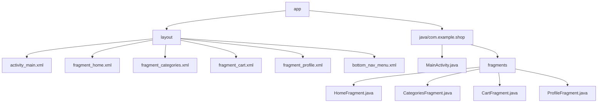

# Shop App Navigation Plan

## 1. Project Structure



## 2. Implementation Steps

1. **Setup Dependencies**
   - Add Navigation Component dependencies in build.gradle
   - Add Material Design dependency for bottom navigation

2. **Create UI Components**
   - Design bottom navigation menu layout
   - Create layout files for each fragment
   - Design a clean and modern navigation UI

3. **Implementation**
   - Create MainActivity as the host activity
   - Implement fragment classes
   - Setup navigation graph
   - Handle navigation state preservation

## 3. Technical Specifications

**Navigation Features:**
- Bottom navigation bar with 4 main tabs
- Smooth fragment transitions
- State preservation during navigation
- Material Design styling

**Layout Structure:**
```xml
<!-- Main Activity Layout Structure -->
<androidx.constraintlayout.widget.ConstraintLayout>
    <androidx.fragment.app.FragmentContainerView>
        <!-- Fragment host -->
    </androidx.fragment.app.FragmentContainerView>
    
    <com.google.android.material.bottomnavigation.BottomNavigationView>
        <!-- Bottom navigation -->
    </com.google.android.material.bottomnavigation.BottomNavigationView>
</androidx.constraintlayout.widget.ConstraintLayout>
```

## 4. Design Details
- Use Material Design guidelines
- Icon-based navigation items with labels
- Consistent color scheme across navigation elements
- Smooth transitions between fragments