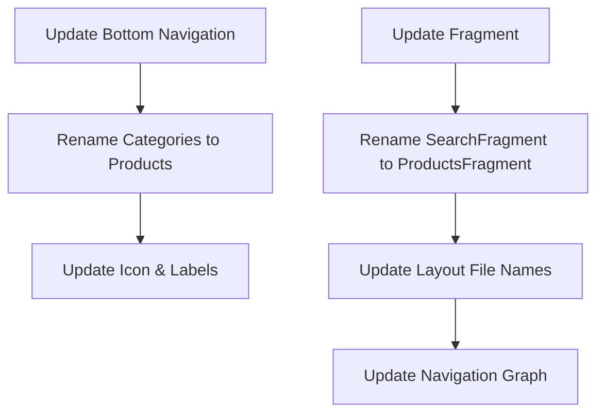
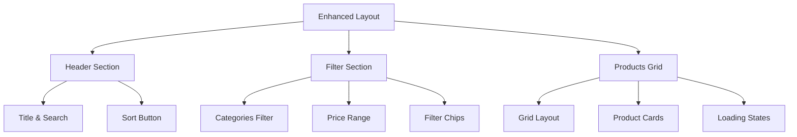

# Products Page Enhancements Plan

## 1. UI/Navigation Updates



## 2. UI Enhancements for Products Page



## 3. Implementation Steps

1. **Rename & Update Files**
   - Rename fragment from `SearchFragment` to `ProductsFragment`
   - Update layout file names
   - Update navigation references
   - Update menu items and resources

2. **Update String Resources**
   ```xml
   <string name="title_products">Products</string>
   <string name="product_search_hint">Search all products…</string>
   <string name="filter_by_category">Filter by Category</string>
   ```

3. **Enhance Product Cards**
   - Add product image loading with placeholder
   - Add favorite button
   - Improve price and discount display
   - Add ratings/reviews
   - Add "Out of Stock" indicator

4. **Improve Filter UI**
   - Collapsible filter section
   - Category chips with icons
   - Price range with min/max inputs
   - Active filters indicator

5. **Add Visual Feedback**
   - Loading shimmer effect
   - Smooth animations for filtering
   - Pull-to-refresh indicator
   - Scroll to top button

## 4. Layout Structure
```xml
<CoordinatorLayout>
    <AppBarLayout>
        <!-- Header with search -->
    </AppBarLayout>
    
    <NestedScrollView>
        <LinearLayout>
            <!-- Filter section -->
            <ChipGroup /> <!-- Categories -->
            <RangeSlider /> <!-- Price -->
            
            <!-- Products grid -->
            <RecyclerView />
        </LinearLayout>
    </NestedScrollView>
    
    <!-- FAB for quick actions -->
    <FloatingActionButton />
</CoordinatorLayout>
```

## 5. Dependencies Required
- AndroidX AppCompat
- Material Design Components
- ConstraintLayout
- SwipeRefreshLayout
- Facebook Shimmer
- Glide (for image loading)

## 6. Feature Implementation Order
1. Basic layout structure and navigation updates
2. Enhanced product cards
3. Improved filters and sorting
4. Visual feedback and animations
5. Performance optimizations