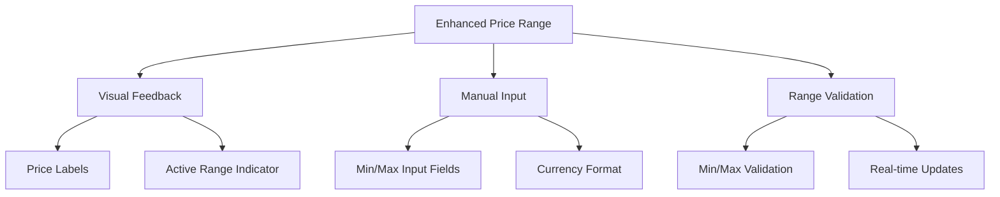
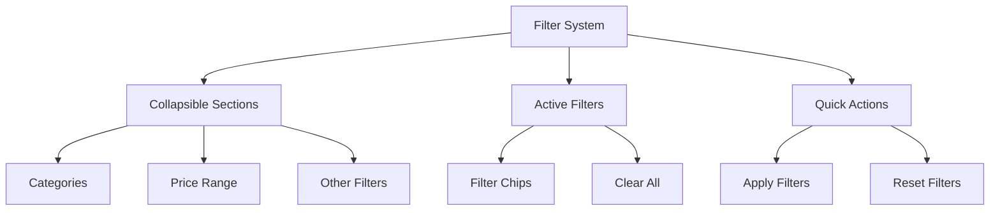
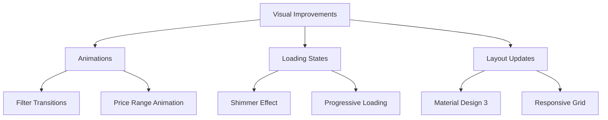
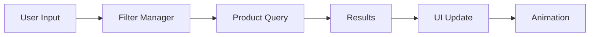

# Product Page and Filter System Enhancement Plan

## 1. Price Range Picker Improvements



### Implementation Details
1. Add input fields for direct price entry
   - Custom TextInputLayout with currency formatting
   - Real-time validation against product price ranges
   - Sync with slider movement

2. Visual feedback improvements
   - Floating labels showing current range values
   - Active range highlight color
   - Price bubbles during slider movement

3. Validation and updates
   - Prevent invalid ranges (min > max)
   - Auto-adjust overlapping values
   - Debounced updates to prevent excessive queries

## 2. Filter System Reorganization



### Implementation Details
1. Collapsible Filter Sections
   - ExpandableFilterGroup custom view
   - Smooth expand/collapse animations
   - State persistence across rotations

2. Active Filters Display
   - Horizontal scrolling chip group
   - Clear individual/all filters
   - Filter count badge on collapsed sections

3. Quick Actions Bar
   - Apply filters button with count
   - Reset all filters option
   - Save filter preset capability

## 3. Visual Enhancements



### Implementation Details
1. Animation System
   - Spring-based animations for filters
   - Smooth transitions between states
   - Coordinated motion for related elements

2. Loading States
   - Shimmer effect during data fetch
   - Progressive loading for product grid
   - Placeholder content during loading

3. Material Design 3 Updates
   - Dynamic color system
   - Updated elevation and shadow system
   - New component styles and shapes

## 4. Code Architecture

### New Components
```kotlin
class CustomPriceRangeView : ConstraintLayout {
    private lateinit var rangeSlider: RangeSlider
    private lateinit var minPriceInput: TextInputLayout
    private lateinit var maxPriceInput: TextInputLayout
    
    private var onPriceRangeChanged: ((min: Double, max: Double) -> Unit)? = null
    
    // State management and validation logic
}

class FilterManager {
    private val activeFilters = MutableStateFlow<List<Filter>>()
    private val filterResults = MutableStateFlow<FilterResults>()
    
    // Filter coordination and state management
}

class ProductGridAnimator {
    fun animateFilterChanges()
    fun animateProductUpdates()
    fun coordinated motion transitions()
}
```

### Data Flow


## 5. Technical Requirements

1. Dependencies
   - AndroidX Core KTX
   - Material Components 1.9.0+
   - ConstraintLayout 2.1.4+
   - facebook/shimmer
   - Kotlin Coroutines

2. Performance Considerations
   - Debounced filter updates
   - Cached filter results
   - Recycled view pools
   - Efficient animations

## 6. Implementation Phases

1. Phase 1: Price Range (Week 1)
   - Custom price range component
   - Input validation system
   - Real-time updates

2. Phase 2: Filter System (Week 2)
   - Collapsible sections
   - Active filters
   - Filter coordination

3. Phase 3: Visual Polish (Week 3)
   - Animation system
   - Loading states
   - Material Design 3 upgrade

4. Phase 4: Testing & Optimization (Week 4)
   - Performance testing
   - UI testing
   - Bug fixes