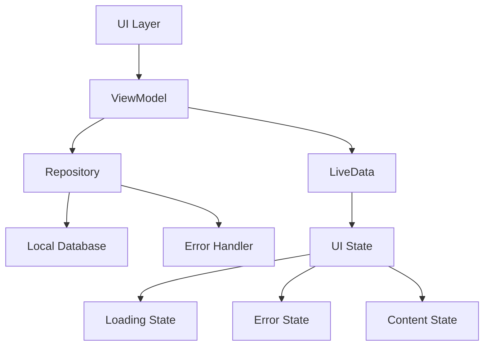
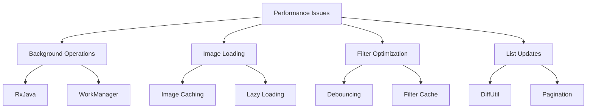

# Product Page Redesign and Enhancement Plan (Java Implementation)

## 1. Architecture Improvements

### Current Issues
- Direct database operations in UI layer
- Missing ViewModel implementation
- No state management
- Lack of error handling

### Solutions


### Implementation Details
1. Create ProductViewModel
```java
public class ProductViewModel extends ViewModel {
    private final MutableLiveData<ProductUiState> uiState;
    private final MutableLiveData<FilterState> filterState;
    private final ProductRepository repository;
    
    // State management and business logic
    public LiveData<ProductUiState> getUiState() {
        return uiState;
    }
    
    public void loadProducts(FilterState filters) {
        // Async loading with error handling
    }
}

public abstract class ProductUiState {
    public static class Loading extends ProductUiState {}
    public static class Success extends ProductUiState {
        private final List<Product> products;
        // Constructor and getters
    }
    public static class Error extends ProductUiState {
        private final String message;
        // Constructor and getters
    }
}
```

2. Create ProductRepository
```java
public class ProductRepository {
    private final ProductDao productDao;
    private final ImageLoader imageLoader;
    private final FilterManager filterManager;
    
    // Repository methods with RxJava for async operations
    public Single<List<Product>> getProducts(FilterState filters) {
        return Single.fromCallable(() -> productDao.getAll(
            filters.getQuery(),
            filters.getCategoryId(),
            filters.getMinPrice(),
            filters.getMaxPrice(),
            filters.getSortOption()
        )).subscribeOn(Schedulers.io());
    }
}
```

3. Implement Error Handler
```java
public class ErrorHandler {
    public static class ApiError extends Exception {
        private final ErrorType type;
        // Constructor and methods
    }
    
    public String getReadableMessage(Exception error) {
        // Convert errors to user-friendly messages
    }
}
```

## 2. Performance Optimizations

### Current Issues
- UI thread blocking
- Inefficient image loading
- No debouncing for filters
- Full dataset reloads

### Solutions


### Implementation Details
1. Background Processing
```java
public class ProductWorker extends Worker {
    @NonNull
    @Override
    public Result doWork() {
        // Background processing logic
        return Result.success();
    }
}

// RxJava for async operations
public class ProductRepository {
    public Observable<List<Product>> getProductsStream(FilterState filters) {
        return Observable.fromCallable(() -> productDao.getAll(filters))
            .subscribeOn(Schedulers.io())
            .observeOn(AndroidSchedulers.mainThread());
    }
}
```

2. Image Loading Optimization
```java
public class ImageLoader {
    private final LruCache<String, Bitmap> memoryCache;
    private final DiskLruCache diskCache;
    
    public void loadImage(String url, ImageView target) {
        // Check memory cache
        // Check disk cache
        // Download if not cached
        // Apply transformations
    }
}
```

3. Filter System Optimization
```java
public class FilterManager {
    private final PublishSubject<FilterState> filterSubject;
    
    public Observable<FilterState> getFilterUpdates() {
        return filterSubject
            .debounce(300, TimeUnit.MILLISECONDS)
            .distinctUntilChanged();
    }
}
```

4. List Performance
```java
public class ProductDiffCallback extends DiffUtil.Callback {
    private final List<Product> oldList;
    private final List<Product> newList;
    
    @Override
    public boolean areItemsTheSame(int oldPos, int newPos) {
        return oldList.get(oldPos).getId() == newList.get(newPos).getId();
    }
    
    @Override
    public boolean areContentsTheSame(int oldPos, int newPos) {
        return oldList.get(oldPos).equals(newList.get(newPos));
    }
}
```

## 3. UI/UX Improvements

### Custom Views
```java
public class EnhancedPriceRangeView extends ConstraintLayout {
    private RangeSlider rangeSlider;
    private TextInputLayout minPriceInput;
    private TextInputLayout maxPriceInput;
    
    public void setPriceRange(double min, double max) {
        // Update price range with validation
    }
    
    private void validateRange() {
        // Ensure min <= max
        // Update UI accordingly
    }
}

public class ProductListView extends RecyclerView {
    private ProductAdapter adapter;
    private ProductViewModel viewModel;
    
    private void initializeList() {
        // Set up adapter with DiffUtil
        // Add scroll listeners for pagination
        // Initialize item animations
    }
}
```

### Loading States
```java
public class ShimmerProductAdapter extends RecyclerView.Adapter<RecyclerView.ViewHolder> {
    private static final int TYPE_SHIMMER = 0;
    private static final int TYPE_PRODUCT = 1;
    
    @Override
    public int getItemViewType(int position) {
        return isLoading ? TYPE_SHIMMER : TYPE_PRODUCT;
    }
}
```

## 4. Implementation Phases

### Phase 1: Architecture Refactoring (Week 1)
- Set up ViewModel and LiveData structure
- Implement Repository pattern
- Add RxJava for async operations
- Create error handling system

### Phase 2: Performance Optimization (Week 2)
- Implement WorkManager for background tasks
- Add image loading optimizations
- Set up filter debouncing
- Implement DiffUtil for list updates

### Phase 3: UI/UX Enhancement (Week 3)
- Add shimmer loading states
- Enhance filter components
- Implement smooth animations
- Add state persistence

### Phase 4: Testing & Polish (Week 4)
- Write JUnit tests
- Add UI tests with Espresso
- Perform performance profiling
- Fix bugs and optimize