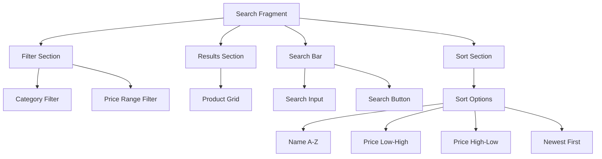

# Search Page Implementation Plan

## 1. UI Components Structure



## 2. Implementation Steps

1. **Search Layout**
   - Search bar at the top
   - Filter and sort options in expandable section
   - Results grid with sort header

2. **Sorting Components**
   - Sort dropdown menu with options:
     * Name (A-Z, Z-A)
     * Price (Low-High, High-Low)
     * Date Added (Newest, Oldest)
   - Sort indicator in results header
   - Remember last used sort option

3. **Database Updates**
```sql
-- Example sort queries
ORDER BY 
  CASE sort_type
    WHEN 'name_asc' THEN name
    WHEN 'name_desc' THEN name DESC
    WHEN 'price_asc' THEN price
    WHEN 'price_desc' THEN price DESC
    WHEN 'date_desc' THEN created_at DESC
    WHEN 'date_asc' THEN created_at
  END
```

## 3. Technical Components

1. **Sort Menu Implementation**
```java
enum SortOption {
    NAME_ASC("Name (A-Z)"),
    NAME_DESC("Name (Z-A)"),
    PRICE_ASC("Price: Low to High"),
    PRICE_DESC("Price: High to Low"),
    DATE_DESC("Newest First"),
    DATE_ASC("Oldest First")
}
```

2. **UI Elements**
- MaterialButton with dropdown for sort options
- Sort direction indicator icons
- Chip group for active filters
- Sort header in results section

3. **Query Building**
```kotlin
fun buildQuery(search: String?, categoryId: Long?, 
               priceRange: Pair<Double, Double>?,
               sortOption: SortOption): String {
    // Build dynamic query with all parameters
}
```

## 4. User Experience Flow

1. **Initial View**
   - Default sort: Newest First
   - Quick sort buttons for common options
   - Remember user's last sort preference

2. **Interaction Flow**
   - User enters search terms
   - Selects category/price filters
   - Chooses sort option
   - Results update immediately
   - Sort preference persists across sessions

3. **Visual Feedback**
   - Sort direction indicators
   - Active sort option highlighted
   - Loading states during sorts
   - Smooth animations for results reordering